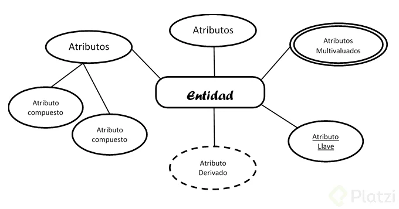

  <h1>Fundamentos de Bases de Datos</h1>

 
  

# Introducción al documento 
El contenido de este documento esta basado en el curso del mismo nombre dictado por **Israel Vázquez Morales** en [Platzi](https://platzi.com).

# Tabla de contenidos
- [Conceptos Básicos](#Conceptos-Básicos)
    - [Tipos de bases de datos](#Tipos-de-bases-de-datos)
    - [Servicios](#Servicios)
- [Introducción a las bases de datos relacionales](#Introducción-a-las-bases-de-datos-relacionales)
    - [Historia de las RDB](#Historia-de-las-RDB)
    - [Entidades y Atributos](#Entidades-y-Atributos)

# Conceptos Básicos
### Tipos de bases de datos
- **Relacionales**: En la industria hay varias compañías dedicadas a ser manejadoras de bases de datos relacionales como **SQL Server, Oracle, MariaDB**, entre otras.
- **No relacionales**: Todavía están avanzando y existen ejemplos muy distintos como **cassandra, elasticsearch, neo4j, MongoDB**, entre otras.

### Servicios
- **Auto administrados**: Es la base de datos que instalas tú y te encargas de actualizaciones, mantenimiento, etc.
- **Administrados**: Servicios que ofrecen las nubes modernas como Azure y no debes preocuparte por mantenimiento o actualizaciones.

# Introducción a las bases de datos relacionales
### Historia de las RDB
**RDB** es lo mismo que **relational data bases** o en español **bases de datos relacionales**.

Las bases de datos surgen de la necesidad de conservar la información más allá de lo que existe en la memoria **RAM**.

Las bases de datos **basadas en archivos** eran datos guardados en texto plano, fáciles de guardar pero muy difíciles de consultar y por la necesidad de mejorar esto nacen las **bases de datos relacionales**. Su inventor **Edgar Codd** dejó ciertas reglas para asegurarse de que toda la filosofía de las bases de datos no se perdiera, estandarizando el proceso.

### Entidades y Atributos

Una **entidad** es algo similar a un objeto (programación orientada a objetos) y representa algo en el mundo real, incluso algo abstracto. Tienen atributos que son las cosas que los hacen ser una entidad y por convención se ponen en plural.

Los **atributos compuestos** son aquellos que tienen atributos ellos mismos.

Los **atributos llave** son aquellos que identifican a la entidad y no pueden ser repetidos. Existen:

- **Naturales**: Son inherentes al objeto como el número de serie
- **Clave artificial**: No es inherente al objeto y se asigna de manera arbitraria.

**Entidades débiles**: No pueden existir sin una entidad fuerte y se representan con un cuadrado con doble línea.

- Identidades débiles por identidad: No se diferencian entre sí más que por la clave de su identidad fuerte.
- Identidades débiles por existencia: Se les asigna una clave propia.

Estas pueden ser:
-  **Concreta**: Persona, empleado, casa, auto, etc …
- **Abstracta**: cta bancaría, empresa, curso

 
  

- **Multivaluados**: puede tener varios valores (teléfonos, hijos, discos duros)
- **Compuestos**: desde los cuales se desprenden más atributos
- **Llave**: aquel que identifica la entidad y no se puede repetir y existen dos tipos:
    - Natural: Son inherentes del Objeto (Cedula, No. Serie)
    - Artificial: No es inherente al objeto y se asigna arbitrariamente
- **Derivados**: es aquel que se obtiene de un atributo definido (fecha Nac = edad)

### Relaciones

  <h4>Relaciones</h4>

Las relaciones, representadas por un rombo, sirven para crear relaciones entre entidades. Por convención las relaciones son verbos que conectan entidades. Existen entidades multivaluadas o compuestas que tienen vida propia y se relacionan con otras entidades, por lo que se pueden normalizar (concepto que se explicará más adelante)

  <h4>Cardinalidad</h4>

Es una propiedad de las relaciones que indica la cantidad y correspondencia con la que puede estar relacionada una entidad y puede ser uno a uno, uno a varios, varios a uno y varios a varios.

 
  

